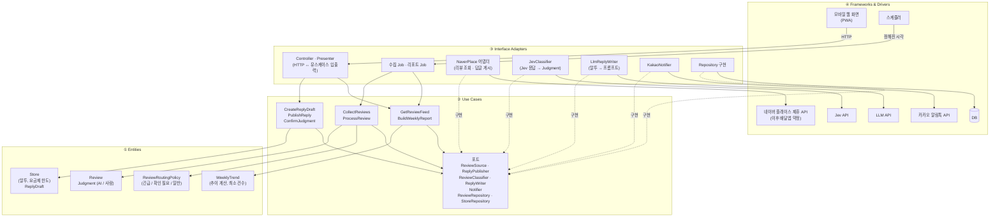

# 리뷰콕 계층 구조

> `02-reviewkok-scenarios.md`의 대표 시나리오 두 개를 바탕으로 그린 첫 계층 구조.
> 기술 스택(언어, 프레임워크, DB 제품)은 아직 정하지 않았고, 이 문서는 그것과 상관없이 성립하도록 썼다.

## 1. 가져온 Clean Architecture 개념

- **4개 계층**: Entities → Use Cases → Interface Adapters → Frameworks & Drivers
- **의존성 규칙**: 소스 코드 의존은 안쪽으로만 향한다. Entities는 아무것도 모른다.
- **포트(인터페이스)**: Use Cases 계층이 필요한 외부 기능을 인터페이스로 정의하고, 바깥 계층이 구현한다.
- **경계에서의 데이터 변환**: Jev 응답, 플랫폼 리뷰 형식, 화면용 데이터는 어댑터에서 도메인 객체로 바꾸거나 도메인 객체에서 바꾼다.

MVP 규모에 비해 구조가 무거워 보일 수 있지만 처음부터 넣는다. 이미 확장이 예정돼 있기 때문이다. 채널은 늘어나고, Jev는 교체될 수 있으며(리스크 표), 프랜차이즈용 대시보드도 계획돼 있다.

## 2. 설계 가정 (시나리오 문서의 결정 필요 항목)

간단하고 되돌리기 쉬운 쪽으로 정했다. 파일럿에서 바꿀 수 있고, 바꿔도 포트 뒤의 구현이나 정책 값만 바뀌도록 했다.

| ID | 가정 | 이유 |
|---|---|---|
| D1 수집 | **공식 연동 채널만** 수집한다. MVP는 네이버 플레이스 공식 제휴로 리뷰를 받는다(네이버 직접 제휴, 또는 이미 '플레이스 플러스'로 연동된 POS사를 통해). 제휴 체결이 서비스 시작 조건이다. 조회 주기나 알림 수신 방식은 제휴 조건을 따른다. 배달앱은 별도 약정을 맺으면 같은 `ReviewSource` 포트에 구현을 추가한다. 크롤링과 사장님 계정 위탁은 쓰지 않는다 | 국내 음식점 리뷰는 네이버가 중심이다. 네이버는 공개 API가 없고 제휴로만 연동할 수 있으며(페이히어 선례), 배민·네이버·카카오 약관이 크롤링과 계정 위탁을 금지한다 (`03-research.md` 5절) |
| D2 분류 기준 | 긴급도가 기준 이상이면 신뢰도와 상관없이 **긴급**으로 보고 알림을 보낸다. 신뢰도가 낮으면 알림에 "AI 확신 낮음"을 붙인다. 긴급이 아니면서 신뢰도가 낮으면 **확인 필요**, 나머지는 **일반**. 처음 기준은 긴급도 0.7, 신뢰도 0.6으로 두고 파일럿에서 조정한다 | 차별점 (a) "놓치면 안 되는 리뷰를 먼저 잡는다"를 우선했다. 알림이 잘못 가는 쪽이 리뷰를 놓치는 쪽보다 피해가 작다 |
| D3 순서 | 알림을 먼저 보내고, 초안은 그다음에 만든다 | LLM 응답을 기다리느라 알림이 늦어지지 않는다 |
| D4 화면 | 모바일 웹(PWA) | 알림톡 링크로 바로 열리고, 앱을 설치할 필요가 없다 |
| D5 게시 | 사장님이 초안을 확인·수정하고 "게시"를 누르면 리뷰콕이 제휴 API로 게시한다. 제휴 범위에 답글 게시가 없으면 초안을 복사해 스마트플레이스에서 게시한다. `ReplyPublisher` 포트를 둔다. 자동 게시는 하지 않는다 | 페이히어-네이버 연동에 답글 기능이 포함된 선례가 있다. 사장님 확인을 거치는 원칙은 유지한다 |
| D6 Jev 실패 | 재시도한 뒤에도 실패하면 **확인 필요**로 보낸다 | 놓치지 않고 사람에게 넘긴다 |
| D7 알림 실패 | 다른 수단으로 대신 보내지 않는다. 실패를 기록하고 화면 위쪽에 표시한다 | MVP 범위를 줄인다 |
| D8 긍정 답글 | Jev의 답글 필요 판정을 따른다. 판정이 없어도 사장님이 "초안 만들기"를 누르면 만든다 | LLM 원가를 지키면서 원하는 사장님은 쓸 수 있다 |
| D9 리포트 | 주당 10건 미만이면 추이를 보여 주지 않고 "데이터 부족"으로 표시한다 | 적은 건수로 추이를 말하면 오해를 산다 |

## 3. 계층 다이어그램

실선은 호출과 의존, 점선은 포트 구현이다. ③의 구현체가 ②의 포트를 구현하므로 Use Cases는 Jev, 카카오, DB를 모른다.

## 4. 계층별 역할

| 계층 | 들어가는 것 | 들어가면 안 되는 것 |
|---|---|---|
| ① Entities | 리뷰, 판정, 분류 규칙(D2 기준값 포함), 요금제 한도, 리포트 추이 규칙(D9) | Jev, LLM, DB, HTTP에 관한 모든 것 |
| ② Use Cases | 시나리오 단계의 순서 조율(판정 → 분류 → 알림 → 초안), 재시도 뒤 확인 필요로 보내기(D6), 포트 정의 | Jev 응답 형식, SQL, 알림톡 메시지 템플릿 |
| ③ Interface Adapters | 외부 형식 ↔ 도메인 객체 변환, LLM 프롬프트 구성, 화면용 데이터 만들기 | 분류 기준, 긴급 판단 같은 업무 규칙 |
| ④ Frameworks & Drivers | 웹 서버, PWA 화면, DB, 스케줄러, 외부 API SDK, 이것들을 조립하는 진입점 | 업무 규칙 |

주의할 경계 두 곳:
- **긴급 판단은 ①의 `ReviewRoutingPolicy`에만 둔다.** `JevClassifier`나 `KakaoNotifier`에 "0.7 이상이면" 같은 조건이 생기면 위반이다.
- **화면은 정렬, 필터, 계산을 하지 않는다.** 긴급도 순 정렬과 확인 필요 묶음은 `GetReviewFeed`가 만들어 넘긴다.

## 5. 시나리오 1이 계층을 지나는 순서

1. ④ 스케줄러 → ③ 수집 Job → ② `CollectReviews`
2. ② `ReviewSource` 포트 → ③ NaverPlace 어댑터 → ④ 네이버 플레이스 제휴 API. 네이버 리뷰 형식은 ③에서 `Review`로 바뀐다.
3. ② `ProcessReview` → `ReviewClassifier` 포트 → ③ `JevClassifier` → ④ Jev API. Jev 응답은 ③에서 `Judgment`로 바뀐다.
4. ② → ① `ReviewRoutingPolicy`가 **긴급**으로 판정한다.
5. ② `Notifier` 포트 → ③ `KakaoNotifier` → ④ 알림톡 (D3: 알림 먼저)
6. ② `ReplyWriter` 포트 → ③ `LlmReplyWriter` → ④ LLM API → 초안 저장
7. ④ PWA에서 김씨가 초안을 고치고 "게시" → ③ Controller → ② `PublishReply` → `ReplyPublisher` 포트 → ③ NaverPlace 어댑터 → ④ 네이버 플레이스 제휴 API

## 6. 의존 방향 검사

코드를 시작할 때 계층 규칙을 검사 도구로 강제한다. 도구는 언어가 정해지면 고른다. 예: TypeScript면 `dependency-cruiser`, Python이면 `import-linter`.

- ①은 다른 계층을 import하지 않는다.
- ②는 ①만 import한다.
- ③은 ①과 ②를 import한다. ③끼리는 서로 import하지 않는다.
- ④의 진입점만 모든 계층을 조립한다.
